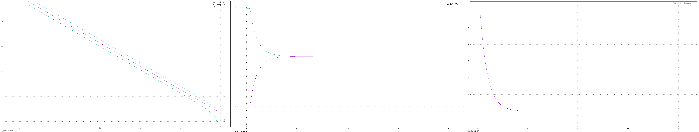

# Steering Control Module
[](https://travis-ci.org/sauravkdeo/Steering-Control-Module)
[](https://coveralls.io/github/sauravkdeo/Steering-Control-Module?branch=master)
---

## Overview


This Steering-Control-Module project takes continuous input of Target coordinate and vehicle velocity and delivers continuous output of steering angle in radians and individual velocities of the left and right wheel ends.

<p align="center">
<a target="_blank">
</a>
</p>


## Purpose

###### Main Features

The module will take target head and vehicle instantaneous velocity as inputs and give the steering angle and the velocities of the individual drive wheels as outputs. The control module can steer the vehicle in an obstacle free environment and achieve the intended target head. This module can be used in an autonomous system, where it can be used by other path and perception modules to steer the vehicle in a specific way. The module will consider the vehicle is placed at O(0,0) coordinates facing toward Y axis.
The distance between the front wheel and the drive axle is defined as wheelbase, the distance between the the drive wheels is defined by track-width and the center of gravity of the vehicle is a point from which the weight of the vehicle may be considered to act. The height of center of gravity is also taken as input to check for vehicle tuple while steering. The stability factor calculation is based upon the vehicle track width and height of the Vehicle center of gravity.These three parameters will vary from vehicle to vehicle.The module allows to pass the values of these parameters.
x, y coordinates of the target will be updated for the current vehicle position after every 0.01 time unit , based on the direction of the target. Based on the mentioned inputs, the module will provide the steering angle and the individual speeds of the driving wheels to move in straight or turning path. The module will also consider the stability factor of the vehicle and check whether the change in the steering angle does not cross the limit for the given velocity, such that  the vehicle may tuple.The module also checks whether turning right or turning left will lead to approach target faster.


###### Safety

The Control module will steer a three wheel tricycle with either maximum steering angle constraint of 30 degree or calculated steering angle constraint to prevent vehicle tuple for a given velocity.Based on these two values , the module will choose the minimum of two as steering angle constraint.

###### Results / Performance of the module

The undermentioned result considers the wheelbase, track-width and the height of center of gravity of the vehicle 3 unit, 2 unit, 0.5 unit respectively.The method has_reached_target returns true if the front wheel of the vehicle is within the 1 unit radius of the target coordinate.This vicinity can be further optimized based on the realistic situation or data.


a) The target coordinates are  in I-st quadrant at (50,50). The vehicle velocity is considered 10 unit/sec. The undermentioned plot describes the motion of the wheels,the steering angle and the individual speeds of the drive wheel ends.

- Fig showing the wheel movement, speed and Steering angle respectively for the above-mentioned condition

<p align="center">
<a target="_blank">

</a>
</p>


b) The target coordinates are  in II-nd quadrant at (-50,50). The vehicle velocity is considered 10 unit/sec. The undermentioned plot describes the motion of the wheels,the steering angle and the individual speeds of the drive wheel ends.

- Fig showing the  wheel movement, speed and Steering angle respectively for the above-mentioned condition

<p align="center">
<a target="_blank">
</a>
</p>


c) The target coordinates are  in III-rd quadrant at (-50,-50). The vehicle velocity is considered 10 unit/sec. The undermentioned plot describes the motion of the wheels,the steering angle and the individual speeds of the drive wheel ends.

- Fig showing the  wheel movement, speed and Steering angle respectively for the above-mentioned condition

<p align="center">
<a target="_blank">
</a>
</p>


d) The target coordinates are  in IV-th quadrant at (50,-50). The vehicle velocity is considered 10 unit/sec. The undermentioned plot describes the motion of the wheels,the steering angle and the individual speeds of the drive wheel ends.

- Fig showing the wheel movement, speed and Steering angle respectively for the above-mentioned condition

<p align="center">
<a target="_blank">
</a>
</p>


###### Limitation/Safety

a) Since the steering angle of the vehicle is constraint maximum to thirty degree.There will be always two circle areas on the lateral sides of the vehicle, which are unapproachable using this algorithm.

- Fig showing the wheel movement, speed and Steering angle respectively for unreachable area on the right side of the vehicle

<p align="center">
<a target="_blank">
</a>
</p>

- Fig showing the wheel movement, speed and Steering angle respectively for unreachable area on the left side of the vehicle

<p align="center">
<a target="_blank">
</a>
</p>

b) There is one more constraint that further reduces the steering angle and increases the radius of curvature.It acts at higher speed to prevent vehicle tuple.
ex: For the same vehicle,if the height of center of gravity is increase from 0.5 unit to 2 unit and the vehicle speed is increased from 10 unit/sec to 25unit/sec. The steering angle constraint, which will act, will be because of the safety feature which will prevent the tuple rather than 30 degree constraint.

- Fig showing the wheel movement, speed and Steering angle and bigger radius of curvature for higher speed

<p align="center">
<a target="_blank">
</a>
</p>

###### Results : The graphs shows the proper functionality of the module along  with safety feature on.

## License

BSD 3-Clause License

Copyright (c) 2018, Saurav
All rights reserved.

Redistribution and use in source and binary forms, with or without
modification, are permitted provided that the following conditions are met:

* Redistributions of source code must retain the above copyright notice, this
  list of conditions and the following disclaimer.

* Redistributions in binary form must reproduce the above copyright notice,
  this list of conditions and the following disclaimer in the documentation
  and/or other materials provided with the distribution.

* Neither the name of the copyright holder nor the names of its
  contributors may be used to endorse or promote products derived from
  this software without specific prior written permission.

THIS SOFTWARE IS PROVIDED BY THE COPYRIGHT HOLDERS AND CONTRIBUTORS "AS IS"
AND ANY EXPRESS OR IMPLIED WARRANTIES, INCLUDING, BUT NOT LIMITED TO, THE
IMPLIED WARRANTIES OF MERCHANTABILITY AND FITNESS FOR A PARTICULAR PURPOSE ARE
DISCLAIMED. IN NO EVENT SHALL THE COPYRIGHT HOLDER OR CONTRIBUTORS BE LIABLE
FOR ANY DIRECT, INDIRECT, INCIDENTAL, SPECIAL, EXEMPLARY, OR CONSEQUENTIAL
DAMAGES (INCLUDING, BUT NOT LIMITED TO, PROCUREMENT OF SUBSTITUTE GOODS OR
SERVICES; LOSS OF USE, DATA, OR PROFITS; OR BUSINESS INTERRUPTION) HOWEVER
CAUSED AND ON ANY THEORY OF LIABILITY, WHETHER IN CONTRACT, STRICT LIABILITY,
OR TORT (INCLUDING NEGLIGENCE OR OTHERWISE) ARISING IN ANY WAY OUT OF THE USE
OF THIS SOFTWARE, EVEN IF ADVISED OF THE POSSIBILITY OF SUCH DAMAGE.

## Dependencies
- Google Mock
- CMake version at least 3.2
- Google Test
## Product backlog, Iteration backlog, and Work log Link
[Link to Product Backlog](https://docs.google.com/spreadsheets/d/1aeqX4TXaQq0CxT5Yz05_DmyA5HKT4QWc1yKll7rqzaw/edit?usp=sharing)


## Standard install via command-line and running tests,demo and program
```
git clone -b GMock_Extra_Credit --single-branch https://github.com/sauravkdeo/Steering-Control-Module.git
cd <path to repository>
mkdir build
cd build
cmake ..
make
Run tests: ./test/cpp-test
Run demo: ./demo/demo
Run program: ./app/shell-app
```

## Generate doxygen documentation


```
cd <path to repository>
cd docs
doxygen steer_doxy.Doxyfile
```

## Building for code coverage
```
sudo apt-get install lcov
cmake -D COVERAGE=ON -D CMAKE_BUILD_TYPE=Debug ../
make
make code_coverage
```
This generates a index.html page in the build/coverage sub-directory that can be viewed locally in a web browser.

## Working with Eclipse IDE ##

## Installation

In your Eclipse workspace directory (or create a new one), checkout the repo (and submodules)
```
mkdir -p ~/workspace
cd ~/workspace
git clone --recursive https://github.com/sauravkdeo/Steering-Control-Module.git
```

In your work directory, use cmake to create an Eclipse project for an [out-of-source build] of cpp-boilerplate

```
cd ~/workspace
mkdir -p Steering-Control-Module
cd Steering-Control-Module
cmake -G "Eclipse CDT4 - Unix Makefiles" -D CMAKE_BUILD_TYPE=Debug -D CMAKE_ECLIPSE_VERSION=4.7.0 -D CMAKE_CXX_COMPILER_ARG1=-std=c++14 ../cpp-boilerplate/
```

## Import

Open Eclipse, go to File -> Import -> General -> Existing Projects into Workspace ->
Select "Steering-Control-Module" directory created previously as root directory -> Finish

## Edit

Source files may be edited under the "[Source Directory]" label in the Project Explorer.


## Build

To build the project, in Eclipse, unfold Steering-Control-Module project in Project Explorer,
unfold Build Targets, double click on "all" to build all projects.

## Run

1. In Eclipse, right click on the Steering-Control-Module in Project Explorer,
select Run As -> Local C/C++ Application

2. Choose the binaries to run (e.g. shell-app, cpp-test for unit testing,demo for demo of the module)


## Debug


1. Set breakpoint in source file (i.e. double click in the left margin on the line you want
the program to break).

2. In Eclipse, right click on the Steering-Control-Module in Project Explorer, select Debug As ->
Local C/C++ Application, choose the binaries to run (e.g. shell-app).

3. If prompt to "Confirm Perspective Switch", select yes.

4. Program will break at the breakpoint you set.

5. Press Step Into (F5), Step Over (F6), Step Return (F7) to step/debug your program.

6. Right click on the variable in editor to add watch expression to watch the variable in
debugger window.

7. Press Terminate icon to terminate debugging and press C/C++ icon to switch back to C/C++
perspective view (or Windows->Perspective->Open Perspective->C/C++).

## GMock Details

This repository also illustrates mocking of a class using googlemock and testing the another class which consumes the base class which is being mocked.

- In this repository, Class ```Point``` is being mocked.
- Class ```Point``` is consumed by the Class ```SteeringControl```.
-  The class ```Point``` inherits  the virtual class ```virtualPoint```.
- Another mock class ```MockPoint``` also inherits  the virtual class ```virtualPoint```.
- The mock class ```MockPoint``` is used to test the the class ```SteeringControl``` class.
- Since not all the methods of the ```SteeringControl``` class utilize the ```Point``` class. Mocking is only utilized for testing the methods of the class ```SteeringControl```,where the methods of class ```Point``` is involved.
